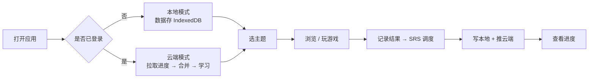

# 01 · 软件需求规格说明书（SRS）

| 项 | 内容 |
|---|---|
| 文档编号 | LV-SRS-v1.0 |
| 版本 | 1.0 |
| 产品名称 | Word Match · 单词碰碰乐（life-vocab-app） |
| 编写日期 | 2026-09-10 |
| 状态 | 已实现并验收 |

---

## 1. 引言

### 1.1 编写目的

本文档定义 life-vocab-app 的功能需求、非功能需求与验收标准，作为概要设计、详细设计、测试与验收的**唯一基准**。

### 1.2 背景与用户画像

本产品为**个人定制**的英语词汇学习工具，核心用户画像如下：

| 维度 | 描述 |
|---|---|
| 职业 | 软件工程师（过程控制 + 机器视觉方向），兼项目经理 |
| 技术领域 | 冶金连铸（Continuous Casting）C# 控制系统维护升级、机器视觉、PLC/SCADA |
| 英语水平 | CET-6；**读写尚可，口语与听力薄弱** |
| 使用场景 | ① 向德国老板做英文项目汇报 ② 与欧洲同事日常协作 ③ 日常生活英语 |
| 使用设备 | 公司电脑、家用电脑、平板、手机（**跨设备**） |
| 网络环境 | 中国大陆（境外服务访问不稳定） |

由此推导出的三条核心诉求：

1. **听说优先** —— 词汇必须能"听到、说出"，而非仅"看到"
2. **跨设备同步** —— 在公司/家里/通勤中都能接着学
3. **场景贴合** —— 词库必须覆盖工业现场与商务汇报，而非通用四六级词表

### 1.3 术语表

| 术语 | 定义 |
|---|---|
| 卡片（Card） | 一个词条的学习单元，含英文、中文、例句、例句译文等 |
| 主题（Topic） | 卡片的一级分类，如"商务汇报""工业现场""中国菜品" |
| 子场景（Subscene） | 主题内的二级分类，用于浏览页筛选，如"华北""点餐用语" |
| SRS | Spaced Repetition System，间隔重复记忆系统 |
| Shadow Pool | 错题池，答错或标记"模糊"的卡片进入该池 |
| 回合（Round） | 一局游戏的运行时状态对象 |
| 额度（Quota） | 每日允许引入的新卡数量上限 |

---

## 2. 总体描述

### 2.1 产品定位

一个**零后端自建**的 PWA 单词学习应用：单文件 HTML 承载全部逻辑与词库，云端仅使用 Supabase 提供的托管服务（Auth + Postgres + PostgREST）做用户数据同步。

### 2.2 运行环境

| 类别 | 要求 |
|---|---|
| 客户端 | Chrome / Edge 90+，Safari 15+（需支持 IndexedDB、Web Speech API） |
| 网络 | 首次加载需联网；之后由 Service Worker 缓存支持离线使用 |
| 服务端 | 无自建服务；依赖 Supabase 云服务 |
| 部署 | 静态托管（当前：Cloudflare Pages） |

### 2.3 用户角色

本产品为单角色系统，仅有**学习者**一个角色。云端数据通过 Supabase Auth 的用户 ID 隔离，无管理员角色。

### 2.4 主要业务流程

---

## 3. 功能需求

### 3.1 功能需求总览

| 编号 | 功能模块 | 优先级 | 状态 |
|---|---|---|---|
| FR-01 | 主题浏览与词卡学习 | P0 | 已实现 |
| FR-02 | 碰碰乐（英中配对） | P0 | 已实现 |
| FR-03 | 听音匹配 | P0 | 已实现 |
| FR-04 | 连连看（记忆翻牌） | P1 | 已实现 |
| FR-05 | 消消乐（单词下落） | P1 | 已实现 |
| FR-06 | 跟读录音评分 | P0 | 已实现 |
| FR-07 | SRS 间隔复习 | P0 | 已实现 |
| FR-08 | 错题本 | P0 | 已实现 |
| FR-09 | 学习进度统计 | P1 | 已实现 |
| FR-10 | 发音（TTS） | P0 | 已实现 |
| FR-11 | 云同步与账号 | P0 | 已实现 |
| FR-12 | PWA 安装与离线 | P1 | 已实现 |
| FR-13 | 设置（语速/口音） | P2 | 已实现 |

### 3.2 FR-01 主题浏览与词卡学习

| 需求点 | 描述 |
|---|---|
| FR-01.1 | 主页以网格展示全部 25 个主题，每主题显示图标、中英文名、卡片数 |
| FR-01.2 | 进入主题后分页浏览词卡，每页 12 张 |
| FR-01.3 | 若主题定义了子场景，浏览页顶部显示子场景筛选 pill，可按子场景过滤 |
| FR-01.4 | 每张词卡提供操作：朗读单词、朗读例句、慢速朗读、标记"熟"、标记"模糊" |
| FR-01.5 | **该套词卡操作在所有渲染词卡的视图中均须可用**（浏览页、今日复习、错题本） |

> FR-01.5 是 v0.9 的一个真实缺陷（事件委托只绑在浏览页容器上，导致错题本/复习页按钮失效），v1.0 已修复并作为回归基线。

### 3.3 FR-02 碰碰乐（Match）

| 需求点 | 描述 |
|---|---|
| FR-02.1 | 从当前主题随机抽取 10 张卡，生成 10 个英文 + 10 个中文棋子，打乱后展示 |
| FR-02.2 | 玩家依次点击两枚棋子，若属于同一张卡则消除，否则记为一次错误并取消选择 |
| FR-02.3 | 实时显示用时（精度 0.1s）、错误次数、得分 |
| FR-02.4 | 全部消除后结算：用时、错误数、得分，并自动开始下一轮 |
| FR-02.5 | 提供"连读全部"按钮，按 700ms 间隔依次朗读本轮全部单词 |

### 3.4 FR-03 听音匹配（Listen）

| 需求点 | 描述 |
|---|---|
| FR-03.1 | 从当前主题随机抽取 8 张卡作为题目队列 |
| FR-03.2 | 每轮自动朗读目标单词（可重复播放） |
| FR-03.3 | 提供 4 个候选（1 正确 + 3 同主题干扰项），玩家选择 |
| FR-03.4 | 答对/答错均给出反馈并揭示正确答案，随后进入下一题 |
| FR-03.5 | 队列完成后结算答对数与最长连击 |

### 3.5 FR-04 连连看（Memory）

| 需求点 | 描述 |
|---|---|
| FR-04.1 | 从当前主题随机抽取 6 张卡，生成 12 枚翻牌（6 英 + 6 中），打乱 |
| FR-04.2 | 每次翻两枚；配对成功则保留，失败则 700ms 后翻回 |
| FR-04.3 | 显示步数、已配对数、用时 |
| FR-04.4 | 全部配对后结算用时、步数、得分 |

### 3.6 FR-05 消消乐（Gravity）

| 需求点 | 描述 |
|---|---|
| FR-05.1 | 单词从顶部下落，玩家在下落过程中选出正确中文释义 |
| FR-05.2 | 提供 4 个候选选项 |
| FR-05.3 | 初始 3 条命；答错或单词落底扣 1 命 |
| FR-05.4 | 显示得分、剩余生命、当前连击与最长连击 |
| FR-05.5 | 生命归零后结算得分与最长连击，并重新开局 |
| FR-05.6 | **离开视图时必须停止下落计时器与发音**（不得在后台继续运行） |

### 3.7 FR-06 跟读录音评分（Record）

| 需求点 | 描述 |
|---|---|
| FR-06.1 | 选择"单词"或"例句"模式，系统朗读目标文本 |
| FR-06.2 | 调用麦克风录音，可停止并回放 |
| FR-06.3 | 使用浏览器语音识别（Web Speech Recognition）转写 |
| FR-06.4 | 与原文比对打分（0–100），逐词标注命中/近似/遗漏 |
| FR-06.5 | 保存历史最佳分，并可将评分同步至云端 |

### 3.8 FR-07 SRS 间隔复习

| 需求点 | 描述 |
|---|---|
| FR-07.1 | 采用 SM-2 简化算法，间隔序列 `[1, 2, 4, 7, 15, 30]` 天 |
| FR-07.2 | "今日复习"**仅统计**：已学且到期的卡 + 错题池中的卡 |
| FR-07.3 | **从未学过的新卡不计入今日复习**，改由每日新词额度限量引入 |
| FR-07.4 | 每日新词额度默认 10 张，跨天自动重置 |
| FR-07.5 | 复习与额度双清零时给出"今日任务全部完成"的正反馈 |
| FR-07.6 | 导航徽标显示待复习数，超过 99 显示 "99+" |

> FR-07.2/07.3 是对 v0.9 计数口径错误的修正：旧版把 2293 张未学新卡算作"今日复习"，导致任务永不可完成。详见 [ADR-0005](./10-ADR-架构决策记录.md)。

### 3.9 FR-08 错题本

| 需求点 | 描述 |
|---|---|
| FR-08.1 | 汇总所有处于错题池（shadow）的卡片 |
| FR-08.2 | 每张卡可执行朗读、标记"熟"、标记"模糊"操作 |
| FR-08.3 | 错题需**连续答对 2 次**才移出错题本 |
| FR-08.4 | 显示错题总量 |

### 3.10 FR-09 学习进度统计

| 需求点 | 描述 |
|---|---|
| FR-09.1 | KPI 卡片：已学卡数、掌握数、错题数、今日待复习、XP、连续天数 |
| FR-09.2 | SRS 阶梯图：按间隔档位展示卡片分布 |
| FR-09.3 | 基于当前状态给出学习建议 |

### 3.11 FR-10 发音（TTS）

| 需求点 | 描述 |
|---|---|
| FR-10.1 | 使用浏览器内置 SpeechSynthesis 朗读单词与例句 |
| FR-10.2 | 支持慢速模式（rate 0.85） |
| FR-10.3 | 支持语速设置（0.85 / 1.0 / 1.2） |
| FR-10.4 | 支持口音切换（en-GB / en-US） |
| FR-10.5 | 不依赖外部音频文件（词库构建时剥离 mp3 路径，避免 404） |

### 3.12 FR-11 云同步与账号

| 需求点 | 描述 |
|---|---|
| FR-11.1 | 邮箱 + 密码注册/登录（Supabase Auth） |
| FR-11.2 | 登录成功后自动拉取云端进度并与本地合并 |
| FR-11.3 | 学习结果写入本地后立即异步推送云端 |
| FR-11.4 | **离线时写入进入本地队列，恢复联网后自动补传** |
| FR-11.5 | 未登录/未配置云时降级为纯本地模式，功能不受影响 |
| FR-11.6 | 用户只能读写自己的数据（服务端 RLS 强制） |

### 3.13 FR-12 PWA 安装与离线

| 需求点 | 描述 |
|---|---|
| FR-12.1 | 提供 Web App Manifest，支持"添加到桌面/主屏" |
| FR-12.2 | Service Worker 缓存核心资源，支持离线打开 |
| FR-12.3 | 展示安装引导横幅，可关闭，关闭后 24 小时内不再弹出 |

### 3.14 FR-13 设置

支持语速、口音（locale）等偏好设置，持久化到本地并同步至云端。

---

## 4. 非功能需求

| 编号 | 类别 | 需求 |
|---|---|---|
| NFR-01 | 性能 | 首屏可交互时间 < 3s（4G 网络）；单文件产物 gzip 后 ≤ 250KB |
| NFR-02 | 性能 | 词库 3230 张卡全部内嵌，浏览页分页渲染（每页 12 张）避免长列表卡顿 |
| NFR-03 | 离线可用 | 断网状态下仍可浏览、学习、游戏；联网后自动补传 |
| NFR-04 | 跨设备 | 同一账号在不同设备的学习进度一致 |
| NFR-05 | 兼容性 | Chrome / Edge / Safari 主流版本；移动端竖屏优先 |
| NFR-06 | 安全 | 前端仅持有 anon/publishable key；用户数据服务端 RLS 隔离；不得出现 XSS |
| NFR-07 | 可维护性 | 词库扩充必须走脚本化流水线，可重复执行、自动去重、自动备份 |
| NFR-08 | 可移植性 | 产物为纯静态文件，可部署到任意静态托管 |
| NFR-09 | 可访问性 | 中国大陆网络可正常访问（无需备案） |

---

## 5. 数据需求

| 编号 | 需求 |
|---|---|
| DR-01 | 词库规模 ≥ 3000 张卡片（当前 3230） |
| DR-02 | 主题数 ≥ 20（当前 25），须覆盖：日常生活、职场商务、工业现场、学术雅思、中国菜品 |
| DR-03 | 每张卡片必须包含：英文、中文释义、英文例句、例句译文 |
| DR-04 | 同一主题内英文词条不得重复 |
| DR-05 | 学习进度数据须按"用户 + 卡片 + 模式"维度存储 |
| DR-06 | 支持录音评分历史（含转写文本与逐词命中详情） |

---

## 6. 约束与假设

| 编号 | 约束 |
|---|---|
| C-01 | **不自建后端服务器** —— 云端能力全部由 Supabase 托管服务提供 |
| C-02 | 前端产物为**单 HTML 文件**（词库与代码内嵌），便于离线与分发 |
| C-03 | 部署目标必须在中国大陆可访问且**免 ICP 备案** |
| C-04 | 音频不随产物分发，发音依赖浏览器 TTS |
| C-05 | 用户量极小（个位数），无并发与容量压力 |

---

## 7. 验收标准

| 编号 | 验收项 | 判定标准 |
|---|---|---|
| AC-01 | 词库完整性 | 卡片 3230 张，主题 25 个，关键字段（en/zh/ex/ex_zh/topic）100% 完整 |
| AC-02 | 数据唯一性 | 同主题内英文词条零重复 |
| AC-03 | 游戏功能 | 5 个游戏均可正常开局、作答、结算 |
| AC-04 | 生命周期 | 切换视图后，旧游戏的计时器与发音均停止 |
| AC-05 | 词卡操作 | 浏览页、今日复习、错题本三处的发音与标记按钮均生效 |
| AC-06 | SRS 计数 | "今日复习"数量 = 到期卡 + 错题，不含未学新卡 |
| AC-07 | 云同步 | 注册 → 学习 → 推送 → 换设备拉取，进度一致；RLS 隔离生效 |
| AC-08 | 离线 | 断网后可继续学习，联网后自动补传 |
| AC-09 | PWA | 可安装到桌面，离线可打开 |
| AC-10 | 自动化 | 全部测试套件通过 |

验收结论见 [13-RELEASE-v1.0.md](./13-RELEASE-v1.0.md)。
