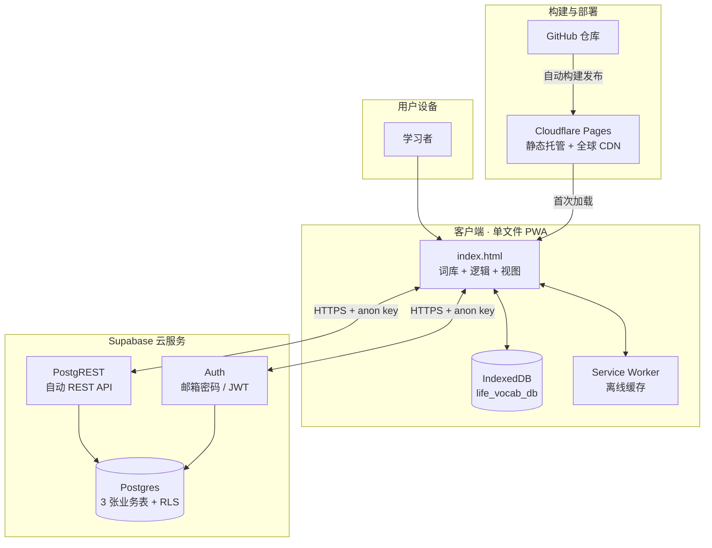
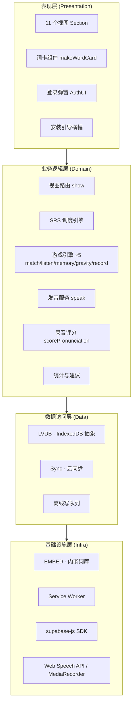
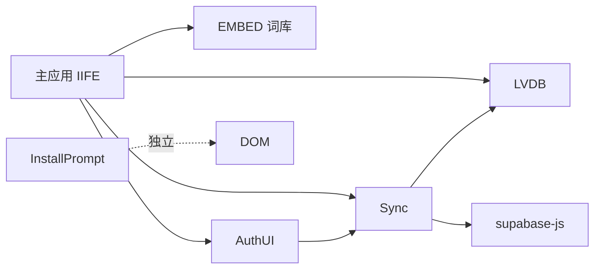
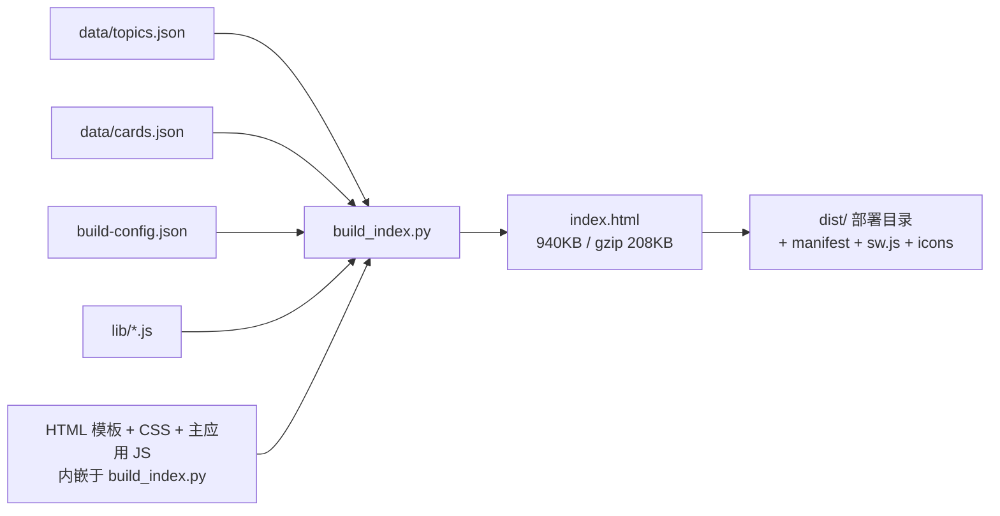
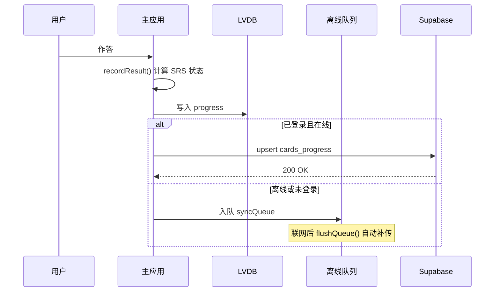

# 02 · 概要设计说明书（HLD）

| 项 | 内容 |
|---|---|
| 文档编号 | LV-HLD-v1.0 |
| 版本 | 1.0 |
| 上游文档 | [01-SRS-需求规格说明书.md](./01-SRS-需求规格说明书.md) |
| 下游文档 | [03-LLD-详细设计说明书.md](./03-LLD-详细设计说明书.md) |

---

## 1. 系统上下文

本系统为**纯客户端应用 + 托管云服务**架构，不存在自建的应用服务器。

### 1.1 边界说明

| 边界 | 内侧（本系统） | 外侧（外部依赖） |
|---|---|---|
| 计算 | 全部在浏览器 | Supabase（认证、存储）、Cloudflare Pages（分发） |
| 数据 | 词库（内嵌）、学习进度（本地 + 云） | 词库源数据（本地 JSON 文件，构建期输入） |
| 网络 | 仅在同步、加载 SDK 时需要 | 断网时降级为纯本地 |

---

## 2. 总体架构

### 2.1 分层架构

### 2.2 运行时进程视图

单页面应用，全部逻辑运行在**一个浏览器渲染进程**中；Service Worker 运行在独立线程；IndexedDB 由浏览器存储进程托管。

| 运行时 | 职责 | 生命周期 |
|---|---|---|
| 主渲染线程 | UI 渲染、游戏逻辑、SRS 计算、TTS 调用 | 页面打开期间 |
| Service Worker 线程 | 资源缓存、离线响应 | 事件驱动，浏览器托管 |
| Supabase SDK（主线程内） | 认证、REST 请求 | 页面打开期间 |

---

## 3. 模块划分

### 3.1 源码模块清单

| 模块 | 载体 | 行数 | 职责 |
|---|---|---|---|
| **主应用** | `build_index.py` 内嵌模板 | ~1650 | 状态管理、路由、SRS、5 个游戏、录音评分、统计视图 |
| **LVDB** | `lib/db.js` | 149 | IndexedDB 抽象（5 个 object store），Promise 化 |
| **Sync** | `lib/sync.js` | 359 | Supabase 客户端、认证、推/拉、离线队列、冲突合并 |
| **AuthUI** | `lib/auth-ui.js` | 173 | 登录/注册弹窗、顶栏状态徽章、Toast |
| **InstallPrompt** | `lib/install-prompt.js` | 79 | PWA 安装引导横幅 |
| **Service Worker** | `sw.js` | ~70 | 导航 network-first（离线回退缓存）+ 静态资源 cache-first + 版本清理 |
| **构建脚本** | `build_index.py` | 2608 | 读取词库与配置 → 生成单文件 `index.html` → 输出 `dist/` |
| **词库流水线** | `expand_vocab.py` | ~200 | 批次合并、去重、备份、统计 |
| **音频生成（可选）** | `gen_audio.py` | — | edge-tts 批量生成 mp3（当前配置下不启用） |

### 3.2 模块依赖关系

**关键约束**：每个 `lib/*.js` 都是独立 IIFE，**模块内不得引用其他模块闭包内的变量**（例如 `$` 工具函数必须各模块自己定义）。此约束源于 v0.9 的一次真实缺陷：`install-prompt.js` 直接使用了 `auth-ui.js` 闭包内的 `$`，导致 `ReferenceError`，安装横幅按钮全部失效。

### 3.3 视图清单（11 个）

| 视图 ID | 名称 | 主责 |
|---|---|---|
| `topics` | 主题主页 | 主题网格、入口导航 |
| `browse` | 浏览 | 分页词卡、子场景筛选 |
| `match` | 碰碰乐 | 英中配对 |
| `listen` | 听音匹配 | 听音选词 |
| `memory` | 连连看 | 记忆翻牌 |
| `gravity` | 消消乐 | 单词下落 |
| `srs` | 今日复习 | 到期卡 + 每日新词 |
| `errors` | 错题本 | 错题池 |
| `record` | 跟读录音 | 录音评分 |
| `progress` | 学习进度 | KPI、SRS 阶梯、建议 |
| `settings` | 设置 | 语速、口音等 |

---

## 4. 技术选型

### 4.1 选型总表

| 层次 | 选型 | 状态 |
|---|---|---|
| 语言 | 原生 JavaScript（ES2017+），无 TypeScript | ✅ 采用 |
| UI 框架 | **无**（原生 DOM 操作 + 模板字符串） | ✅ 采用 |
| 构建 | Python 脚本 `build_index.py` | ✅ 采用 |
| 本地存储 | IndexedDB（经 LVDB 封装） | ✅ 采用 |
| 云端后端 | Supabase（Auth + Postgres + PostgREST） | ✅ 采用 |
| 发音 | 浏览器 Web Speech API（SpeechSynthesis）+ 同源 TTS 代理（有道/百度/Google 双引擎） | ✅ 采用 |
| 语音识别 | Web Speech Recognition | ✅ 采用 |
| 离线 | Service Worker + Manifest（PWA） | ✅ 采用 |
| 部署 | Cloudflare Pages | ✅ 采用 |
| 图标 | 脚本生成 PNG（`make_icons.py`） | ✅ 采用 |

### 4.2 关键选型理由与被否决方案

| 决策点 | 采用 | 否决方案 | 理由 |
|---|---|---|---|
| 应用形态 | Web + PWA | **Tauri 桌面应用** | 需 Rust 工具链与打包，跨设备分发成本高；PWA 一次部署多端可用，且能"添加到桌面"获得近似原生体验 |
| UI 框架 | 原生 DOM | React / Vue | 应用规模小（单文件 940KB，其中绝大部分是词库数据）；引入框架会显著增加产物体积与构建复杂度，且无复杂状态共享需求 |
| 本地存储 | IndexedDB | localStorage | localStorage 有 5MB 上限且仅存字符串；学习进度按"卡×模式"维度增长，且需存离线队列，IndexedDB 更合适 |
| 云端 | Supabase | 自建后端 | 无运维成本；自带 Auth 与 RLS，安全模型现成；免费额度对个位数用户绰绰有余 |
| 发音 | 在线同源 TTS 代理（单词有道 / 例句百度主+Google 备）+ 本地 Web Speech 兜底 | 预生成 mp3（edge-tts） | 2992 个 mp3 共 61MB，既拖慢首屏又无法随词库扩充线性扩展；且 TTS 已能满足学习需求。**注意**：mp3 生成脚本保留但构建时剥离（`build-config.json` → `audio.embed=false`）。在线发音统一走同源 `functions/tts.js` 代理，手机端不依赖任何外部域名（绕开运营商封锁）|
| 部署 | Cloudflare Pages | **Vercel** | `.vercel.app` 在中国大陆访问受限，实测打不开；`*.pages.dev` 可访问 |
| 部署 | Cloudflare Pages | **腾讯云 CloudBase** | 控制台上手曲线陡、文档零散、免费版静态托管权限被锁（需升级 19.9 元/月） |
| 部署 | Cloudflare Pages | 国内云 + ICP 备案 | 备案周期 1–2 周；本项目为个人学习工具，无强备案必要 |

> 完整的决策记录（含上下文、备选、后果）见 [10-ADR-架构决策记录.md](./10-ADR-架构决策记录.md)。

### 4.3 为什么是"单文件 HTML"

理由：

1. **离线友好** —— 一次加载后由 Service Worker 缓存，断网可用
2. **分发简单** —— 双击即可打开，可拷进 U 盘、发邮件、丢进任意静态托管
3. **零构建依赖** —— 部署环境不需要 Node/Python（把 `dist/` 直接提交进仓库）

代价：产物体积随词库线性增长。当前 940KB（gzip 208KB）在可接受范围；若未来词库增长到 1 万卡以上，需改为按需加载分片数据。

---

## 5. 数据架构概览

### 5.1 数据分类

| 数据 | 存储位置 | 是否同步 | 说明 |
|---|---|---|---|
| 词库（topics/cards） | 内嵌于 index.html | ❌ | 静态资源，随版本发布更新 |
| 学习进度 `card_state` | IndexedDB `progress` | ✅ | 按 用户+卡+模式 |
| 全局状态（XP/streak/settings） | IndexedDB `settings` | ✅ | 单条记录 |
| 录音评分 | IndexedDB `recScores` | ✅ | 含转写与逐词命中 |
| 离线写队列 | IndexedDB `syncQueue` | ❌ | 本地临时，补传后清除 |
| 元信息（user_id/last_sync_at） | IndexedDB `meta` | ❌ | 本地 |

### 5.2 数据流

---

## 6. 部署架构

| 环节 | 方案 |
|---|---|
| 源码托管 | GitHub `17SiberianWolf/life-vocab-app`（main 分支） |
| CI/CD | Cloudflare Pages 监听 GitHub push，自动部署 |
| 构建命令 | **留空**（不依赖构建环境） |
| 输出目录 | `dist` |
| 生产域名 | `https://life-vocab-app.pages.dev` |
| 缓存策略 | Service Worker 导航 network-first（离线回退缓存）+ 静态资源 cache-first，版本号 `wordmatch-v16` |

**为何构建命令留空**：Cloudflare Pages 的构建环境不保证存在 python3（Vercel 曾因此失败），故把构建产物 `dist/` 直接提交进仓库，部署时零构建。

---

## 7. 质量属性设计策略

| 质量属性 | 策略 |
|---|---|
| 可用性 | 断网降级本地模式；Supabase SDK 加载失败亦降级 |
| 性能 | 分页渲染（12 张/页）；SRS 页按每日额度限量渲染，避免一次渲染数千张卡 |
| 安全 | 服务端 RLS 强制隔离；前端 `escapeHtml` 防 XSS；不存储敏感信息 |
| 可维护性 | 词库扩充脚本化；`sw.js` 缓存版本必须随每次发布 bump（否则用户拿不到新页面） |
| 可测试性 | 7 个 Node 测试套件，直接校验已构建的 `index.html` |
| 可移植性 | 纯静态产物，可迁移到任意静态托管 |

---

## 8. 关键设计约束（后续开发必须遵守）

| 编号 | 约束 | 违反后果 |
|---|---|---|
| DC-01 | 每个 `lib/*.js` IIFE 内部工具函数必须自行定义 | 跨模块引用闭包变量 → ReferenceError → 功能静默失效 |
| DC-02 | 共用组件（如 `makeWordCard`）的事件委托必须绑在 `document` 级 | 绑在某个容器上 → 复用到新容器时按钮全部失效 |
| DC-03 | 视图切换必须调用 `stopAllGames()` | 旧游戏计时器/TTS 在后台继续运行 |
| DC-04 | 所有延迟回调（setTimeout/setInterval）必须做回合身份校验 | 离开视图后回调仍触发，可能弹窗或重置状态 |
| DC-05 | 每次发布必须 bump `sw.js` 的 `CACHE_NAME` | 旧缓存导致用户永远加载旧页面（导航已改 network-first + `controllerchange` 自动刷新，但静态资源仍 cache-first，bump 仍必须）|
| DC-06 | 词库扩充必须经 `expand_vocab.py`，禁止手改 `cards.json` | 数据格式不一致、重复词条、无备份 |

> 以上每条约束都对应 v0.9 阶段发生过的真实缺陷。
