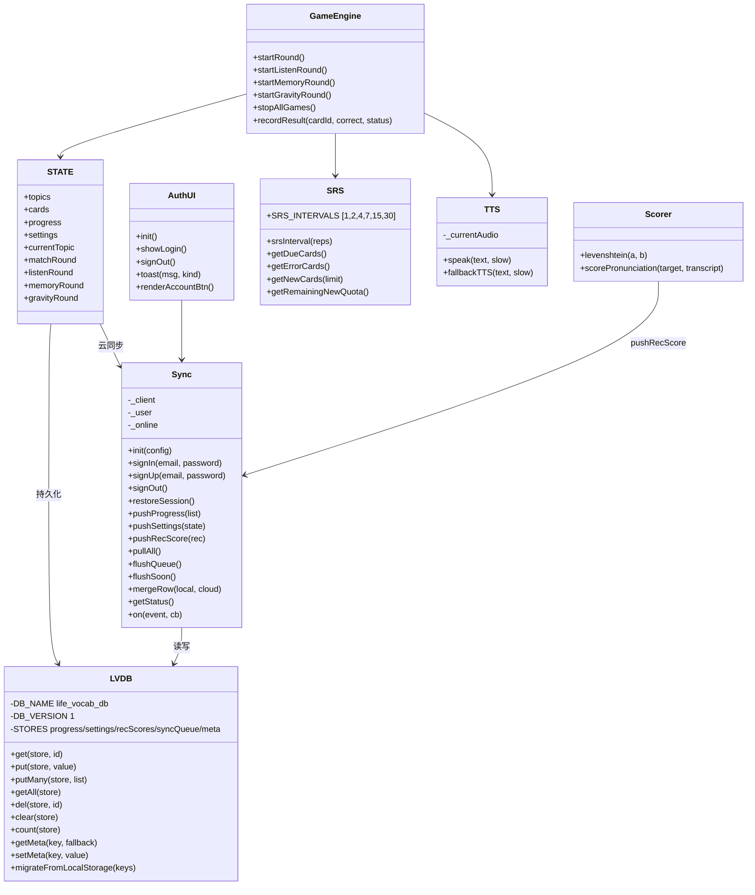
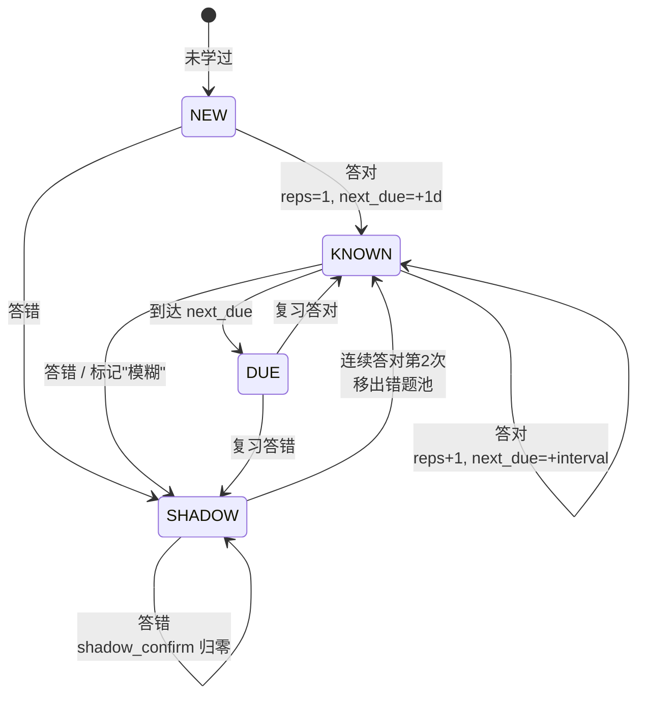
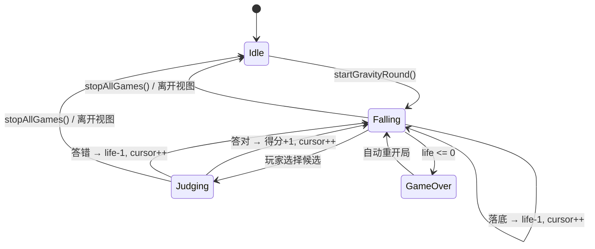
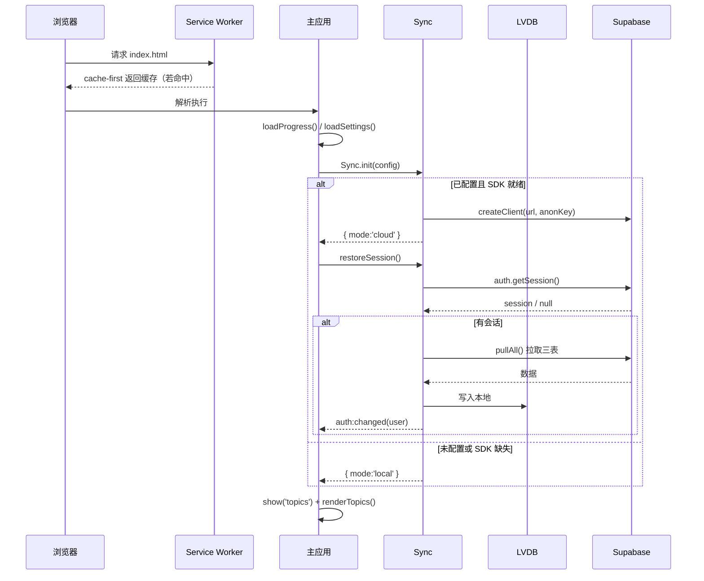
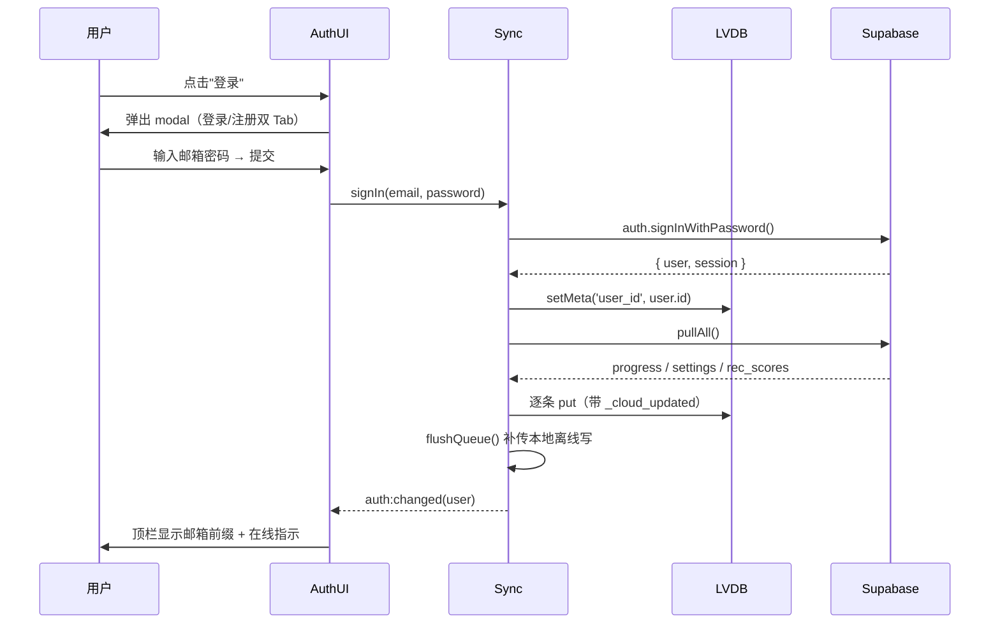
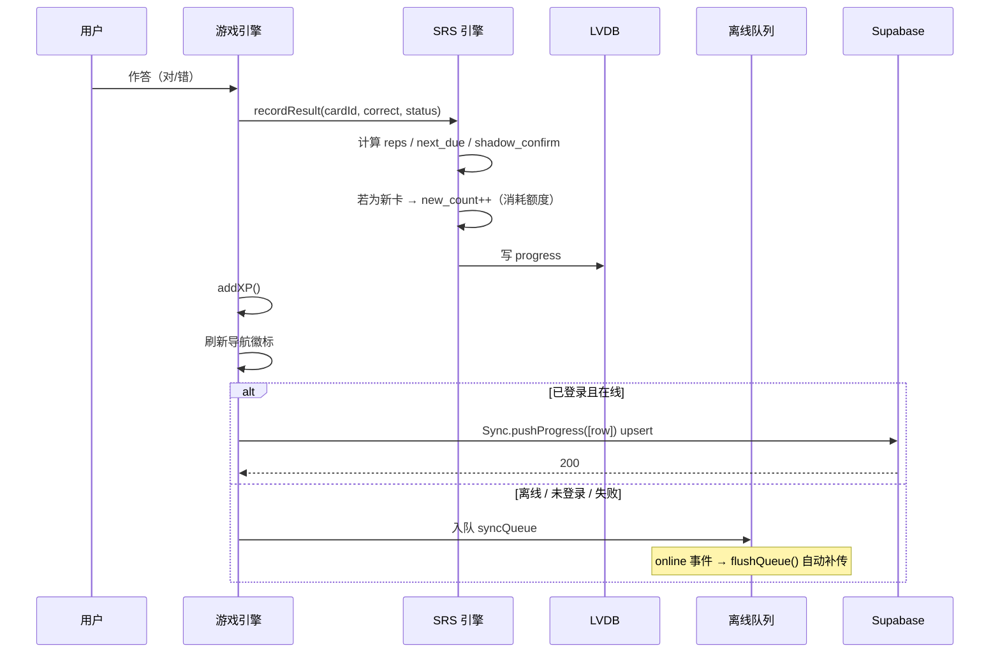
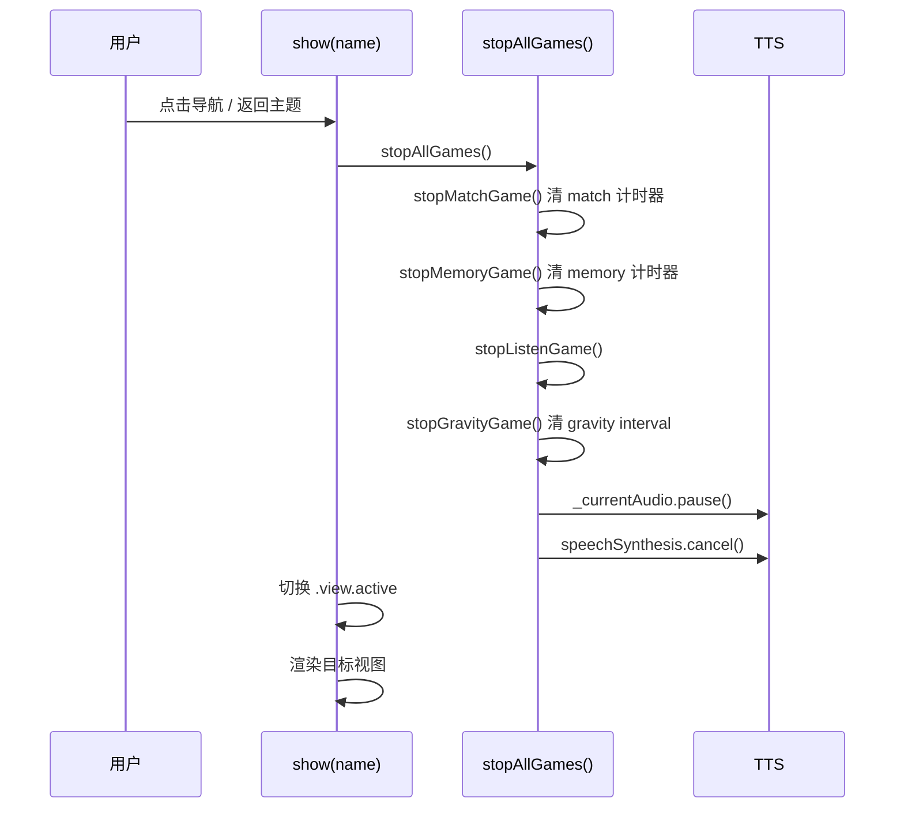
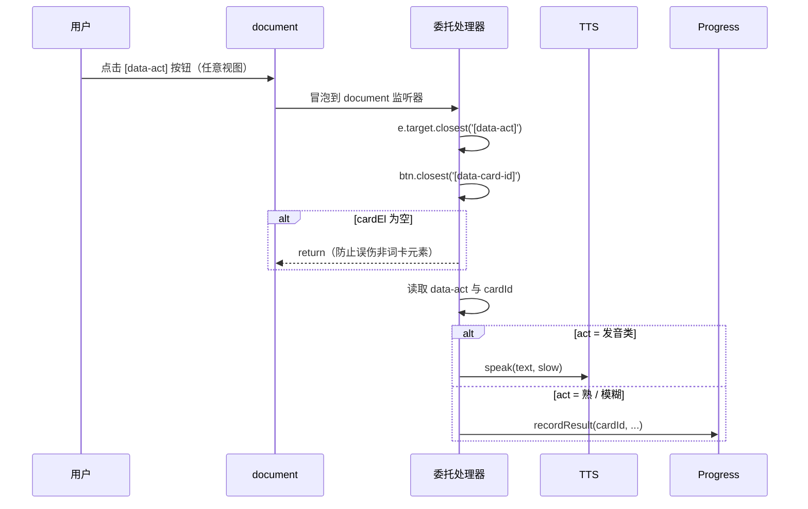

# 03 · 详细设计说明书（LLD）

| 项 | 内容 |
|---|---|
| 文档编号 | LV-LLD-v1.0 |
| 版本 | 1.0 |
| 上游文档 | [02-HLD-概要设计说明书.md](./02-HLD-概要设计说明书.md) |
| 事实来源 | `build_index.py` 主应用 IIFE、`lib/*.js` |

---

## 1. 概述

本文档描述 life-vocab-app 的核心数据结构、模块内部结构、关键流程时序、算法逻辑与伪代码，供后续维护与二次开发使用。

---

## 2. 核心数据结构

### 2.1 全局状态 STATE

```js
const STATE = {
  topics: EMBED.topics,        // 主题数组（只读）
  cards:  EMBED.cards,         // 卡片数组（只读）
  progress: loadProgress(),    // 学习进度（可持久化）
  settings: loadSettings(),    // 用户设置（可持久化）
  currentTopic: null,          // 当前主题 id
  browsePage: 0,               // 浏览页页码
  browseSubscene: '',          // 子场景筛选（'' = 全部）
  pageSize: 12,                // 每页卡片数
  matchRound:  null,           // 碰碰乐回合
  listenRound: null,           // 听音回合
  memoryRound: null,           // 连连看回合
  gravityRound:null,           // 消消乐回合
};
```

### 2.2 进度对象 `progress`

```js
{
  card_state: {                 // key = card.id
    [cardId]: {
      status: 'known' | 'shadow',
      reps: number,             // 连续答对次数
      last_seen: 'YYYY-MM-DD',
      next_due:  'YYYY-MM-DD',
      was_shadow: boolean,      // 是否曾进入错题池
      shadow_confirm: number,   // 错题连对计数（≥2 移出）
    }
  },
  xp: number,
  streak: number,
  last_active: 'YYYY-MM-DD',
  new_date: 'YYYY-MM-DD',       // 新词额度归属日期
  new_count: number,            // 当日已学新卡数
  shadow_pool_meta: {...},
}
```

### 2.3 卡片（Card）

| 字段 | 类型 | 说明 |
|---|---|---|
| `id` | int | 全局唯一主键 |
| `topic` | string | 所属主题 id |
| `en` | string | 英文词条 |
| `zh` | string | 中文释义 |
| `ex` | string | 英文例句 |
| `ex_zh` | string | 例句译文 |
| `sc` | string | 场景/子分类标注（展示用） |
| `scene` | string | 子场景 id（用于 pill 筛选） |
| `tip` | string | 记忆提示（精编卡有，扩充卡可为空） |
| `difficulty` | int \| string | 难度 1–5；商务卡为 `'B'` |
| `tags` | string[] | 标签 |
| `audio_*` | string | 音频路径（**构建时剥离**，运行时为 undefined） |

### 2.4 游戏回合对象

```js
// 碰碰乐
matchRound = { cards, enBoard, zhBoard, board, errors, score,
               startTime, timer, selected, matched:Set }

// 听音
listenRound = { queue, cursor, correct, streak, maxStreak, answered, current }

// 连连看
memoryRound = { tiles, flipped:[], matched:Set, moves, startTime, timer, total }

// 消消乐
gravityRound = { queue, cursor, score, life:3, streak, maxStreak,
                 falling, topPos:-40, fallSpeed:0.6, timer, active }
```

---

## 3. 模块结构图



---

## 4. 状态机

### 4.1 卡片学习状态流转



### 4.2 游戏回合状态（以消消乐为例）



---

## 5. 关键时序图

### 5.1 应用启动与会话恢复



### 5.2 登录并首次同步



> **实现要点**：登录/注册 Tab 切换按钮位于 `<form>` 元素**外部**，因此读取当前 Tab 时必须从 `.lv-auth-modal` 全局查找，不能 `form.querySelector('.lv-tab.active')`（会返回 null 抛出 TypeError，导致点击无反应）。

### 5.3 学习结果记录与同步



### 5.4 视图切换与游戏停止



> **关键设计**：除主动停止外，所有延迟回调还带**回合身份校验**（见 §6.6），构成双重防御。

### 5.5 词卡按钮事件（document 级委托）



---

## 6. 算法逻辑与伪代码

### 6.1 SRS 间隔调度（SM-2 简化）

**设计**：保留 SM-2 的"连续答对次数决定间隔"核心思想，但用固定间隔表替代 ease 因子动态调整，降低实现复杂度与参数调优难度。

```
常量 SRS_INTERVALS = [1, 2, 4, 7, 15, 30]   // 天

函数 srsInterval(reps):
    若 reps <= 0: 返回 1
    返回 SRS_INTERVALS[min(reps - 1, len(SRS_INTERVALS) - 1)]

函数 addDays(dateStr, days):
    d = Date(dateStr + 'T00:00:00')
    d.setDate(d.getDate() + days)
    返回 格式化(d, 'YYYY-MM-DD')
```

**间隔演进示例**：

| 连续答对次数 | 下次间隔 |
|---|---|
| 1 | 1 天 |
| 2 | 2 天 |
| 3 | 4 天 |
| 4 | 7 天 |
| 5 | 15 天 |
| ≥6 | 30 天（封顶） |

### 6.2 recordResult 主流程

```
函数 recordResult(cardId, correct, explicitStatus):
    t = today()
    prev = progress.card_state[cardId] 或 {}
    isNewCard = (cardId 不在 card_state 中)
    wasShadow = (prev.was_shadow == true 或 prev.status == 'shadow')

    若 correct:
        newReps = (prev.reps 或 0) + 1
        interval = srsInterval(newReps)
        若 wasShadow:
            confirmCount = (prev.shadow_confirm 或 0) + 1
            若 confirmCount >= 2:
                next = { status:'known', last_seen:t, reps:newReps,
                         next_due: addDays(t, interval),
                         was_shadow:false, shadow_confirm:0 }
            否则:
                next = { status:'shadow', last_seen:t, reps:prev.reps,
                         next_due: addDays(t, 1),
                         was_shadow:true, shadow_confirm:confirmCount }
        否则:
            next = { status:'known', last_seen:t, reps:newReps,
                     next_due: addDays(t, interval),
                     was_shadow:false, shadow_confirm:0 }
    否则:
        // 答错 → 入错题池，reps 归零，明天再来
        next = { status:'shadow', last_seen:t, reps:0,
                 next_due: addDays(t, 1),
                 was_shadow:true, shadow_confirm:0 }

    若 explicitStatus == 'shadow' 且 correct:
        // 用户主动点"模糊"：进错题池并清空 reps
        next.status = 'shadow'; next.was_shadow = true; next.reps = 0

    若 isNewCard 且 correct 或 已产生状态:
        消耗每日新词额度：new_count++

    保存 next；saveProgress()；addXP(...)
```

**XP 规则**：

| 情形 | XP |
|---|---|
| 答对且错题移出（连对 2 次） | 6 |
| 答对且标记为 known | 5 |
| 答对但仍在错题池 | 3 |
| 答错 | 2 |

### 6.3 每日新词额度

```
常量 DAILY_NEW_DEFAULT = 10

函数 dailyNewGoal():
    返回 settings.daily_new 或 DAILY_NEW_DEFAULT

函数 ensureNewQuota():
    若 progress.new_date != today():
        progress.new_date = today()
        progress.new_count = 0          // 跨天自动重置

函数 getRemainingNewQuota():
    ensureNewQuota()
    返回 max(0, dailyNewGoal() - (progress.new_count 或 0))
```

**设计理由**：词库 3230 张，若把未学新卡全部算作"今日任务"，徽标将显示 2293 且永不可完成。每日限量引入符合 Anki/SuperMemo 的成熟实践，也让每日任务量可控、可完成、有正反馈。

### 6.4 待复习集合计算

```
函数 getDueCards():
    t = today()
    返回 cards.filter(c =>
        s = progress.card_state[c.id]
        若 s 不存在:            返回 false   // 新卡不计入复习
        若 s.was_shadow:        返回 true    // 错题必复习
        若 s.status=='known' 且 (无 next_due 或 next_due <= t):
                                返回 true
        否则 false
    )

函数 getErrorCards():
    返回 cards.filter(c =>
        s = card_state[c.id]
        s 存在 且 (s.status == 'shadow' 或 s.was_shadow == true)
    )

函数 getNewCards(limit):
    返回 cards.filter(c => 无 card_state[c.id]).slice(0, limit)
```

### 6.5 洗牌（Fisher-Yates）

```
函数 shuffle(a):
    arr = a.slice()                       // 不修改原数组
    对 i 从 arr.length-1 递减到 1:
        j = floor(random() * (i + 1))
        交换 arr[i] 与 arr[j]
    返回 arr
```

时间复杂度 O(n)，原地交换，保证每个排列等概率。

### 6.6 回合身份校验（异步泄漏防护）

**问题**：离开视图后，旧的 `setTimeout`/`setInterval` 回调仍会执行，导致后台发音、弹窗、重置状态。

**方案**：每个延迟回调执行前校验"当前回合对象是否仍是自己那一局"。

```
// 反例（会泄漏）
setTimeout(() => { r.cursor++; nextGravity(); }, 400);

// 正解（带身份校验）
const r = STATE.gravityRound;
setTimeout(() => {
    if (STATE.gravityRound !== r) return;   // 已换局或已离开 → 作废
    r.cursor++;
    nextGravity();
}, 400);
```

**配合的主动停止钩子**：

```
函数 stopAllGames():
    stopMatchGame();   // clearInterval + STATE.matchRound = null
    stopMemoryGame();  // clearInterval + STATE.memoryRound = null
    stopListenGame();  // STATE.listenRound = null
    stopGravityGame(); // clearInterval + STATE.gravityRound = null
    若 _currentAudio: _currentAudio.pause(); _currentAudio = null
    若 'speechSynthesis' in window: speechSynthesis.cancel()

函数 show(name, topicId):
    stopAllGames()     // ← 第一件事
    ...切换视图 DOM...
```

### 6.7 跟读录音评分

```
函数 levenshtein(a, b):            // 经典动态规划编辑距离
    O(n*m) 时间, O(m) 空间（滚动数组）

函数 _normTokenize(s):
    转小写 → 去除标点 [.,!?;:"'`()\[\]{}] → 压缩空白 → 按空格分词

函数 scorePronunciation(target, transcript):
    tgt = _normTokenize(target)
    got = _normTokenize(transcript)
    used = Set()
    perWord = tgt.map(w =>
        1) 精确匹配: got 中存在未使用且 === w  → { kind:'hit',   weight:1 }
        2) 模糊匹配: 存在未使用且 levenshtein(got[i], w) <= 1 → { kind:'near', weight:0.5 }
        3) 未命中:                                        → { kind:'miss', weight:0 }
    )
    score = round( sum(weight) / len(tgt) * 100 )
    返回 { score, perWord, raw:{ tgt, got } }
```

**评分规则说明**：

| 匹配类型 | 权重 | 说明 |
|---|---|---|
| 精确命中 | 1.0 | 转写中存在完全相同的词 |
| 模糊命中 | 0.5 | 编辑距离 ≤ 1（容忍识别误差，如单复数、轻微误听） |
| 未命中 | 0 | 完全没说到 |
| 多余词 | 不扣分 | 转写中有而目标没有的词，不惩罚 |

### 6.8 云同步冲突合并（Last-Write-Wins）

```
函数 mergeRow(local, cloud):
    若 cloud 不存在: 返回 local
    若 local 不存在: 返回 cloud
    lt = local._cloud_updated 或 local.updated_at 的时间戳（缺失为 0）
    ct = cloud._cloud_updated 或 cloud.updated_at 的时间戳（缺失为 0）
    若 ct > lt: 返回 { ...local, ...cloud }   // 远端更新 → 采用远端
    若 lt > ct: 返回 local                    // 本地更新 → 保留本地
    返回 local                                // 时间戳相同 → 本地优先
```

**推送策略**：

```
函数 pushProgress(list):
    若未登录: 入队 syncQueue，返回 { queued }
    按 100 条分批:
        upsert(cards_progress, rows, { onConflict: 'user_id,card_id,mode' })
    失败 → 入队，等待 flushQueue 重试
```

**离线补传**：

```
window.addEventListener('online', () => {
    _online = true
    emitStatus()
    flushQueue()          // 自动补传
})
flushSoon(): 防抖 500ms 后 flushQueue()
```

### 6.9 Service Worker 缓存策略

```
策略: cache-first

install:  预缓存 ['./', './index.html', './manifest.webmanifest', 图标...]
          → skipWaiting()
activate: 删除所有非当前 CACHE_NAME 的旧缓存 → clients.claim()
fetch:    缓存命中 → 返回缓存
          未命中   → 请求网络 → 成功后写缓存 → 返回

CACHE_NAME = 'wordmatch-v9'   // 每次发布必须 +1
```

> **发布纪律**：由于 cache-first，若发布时不 bump `CACHE_NAME`，已安装的用户将**永远加载旧页面**，看不到任何修复。

---

## 7. 错误处理策略

| 场景 | 处理 |
|---|---|
| Supabase 未配置 / 占位 URL | 降级本地模式，控制台 info，功能不受影响 |
| supabase-js SDK 未加载（CDN 失败） | 降级本地模式，`reason: 'sdk-missing'` |
| 网络请求失败 | 写入离线队列，联网自动重试 |
| IndexedDB 不可用 | `get`/`getAll` 捕获异常返回 null/[]，不中断主流程 |
| 音频播放失败 | `audio.play().catch(() => fallbackTTS(...))` 兜底浏览器 TTS |
| TTS 不可用 | `if (!('speechSynthesis' in window)) return;` 静默跳过 |
| 词卡 `tip` 字段缺失 | 模板中 `c.tip ? ... : ''` 优雅降级 |
| 事件委托找不到 `cardEl` | `if (!cardEl) return;` 防止误伤 |

---

## 8. 关键实现约束（易错点清单）

| # | 约束 | 原因 |
|---|---|---|
| 1 | `lib/*.js` 每个 IIFE 自带 `$` 等工具函数 | 跨模块引用闭包变量会 ReferenceError |
| 2 | 词卡事件委托绑 `document` 级 | 词卡组件在浏览/复习/错题本三处复用 |
| 3 | `stopAllGames()` + 回合身份校验双保险 | 单靠钩子无法覆盖未来新增的延迟逻辑 |
| 4 | 每次发布 bump `CACHE_NAME` | cache-first 策略 |
| 5 | 构建时剥离 `audio_*` 字段 | 无音频文件分发，避免 404 与体积膨胀 |
| 6 | 词库经 `expand_vocab.py` 合并 | 保证去重（按 en+topic）、备份、字段规范 |
| 7 | 部署产物只取 `dist/` | 避免 `.git/`、`*.py`、`test-*.js` 混入线上 |
