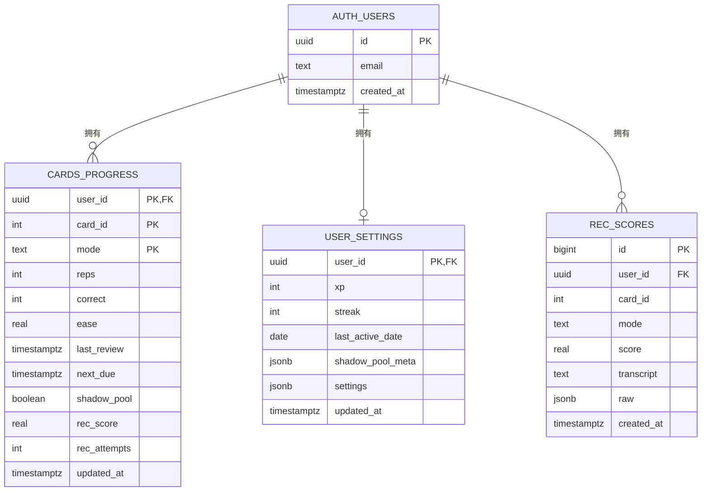

# 04 · 数据库设计说明书

| 项 | 内容 |
|---|---|
| 文档编号 | LV-DB-v1.0 |
| 版本 | 1.0 |
| 数据库 | PostgreSQL 15+（Supabase 托管） |
| 客户端存储 | IndexedDB `life_vocab_db` v1 |
| DDL 源文件 | `supabase/SCHEMA.sql` |

---

## 1. 概述

系统采用**双层存储**：

| 层 | 技术 | 用途 | 是否为源数据 |
|---|---|---|---|
| 云端 | Supabase Postgres | 跨设备同步、备份 | 是（用户进度） |
| 本地 | IndexedDB | 离线可用、快速读写、离线写队列 | 是（本地优先写入） |

词库数据（topics/cards）**不入库**，而是构建期内嵌到 `index.html`，随版本发布。

---

## 2. 概念模型（ER 图）



说明：

- `auth.users` 由 Supabase Auth 托管，业务表仅通过外键引用，**不复制用户信息**
- 三张业务表均通过 `user_id` 与 `auth.users` 关联，并由 RLS 强制隔离
- `cards_progress` 使用**复合主键** `(user_id, card_id, mode)` —— 同一张卡在不同游戏模式下的进度相互独立

---

## 3. 表结构设计

### 3.1 cards_progress — 卡片学习进度

| 列 | 类型 | 默认 | 可空 | 说明 |
|---|---|---|---|---|
| `user_id` | uuid | — | NOT NULL | FK → auth.users(id)，构成 RLS 依据 |
| `card_id` | int | — | NOT NULL | 逻辑外键 → 内嵌词库 `cards[].id`（无物理约束） |
| `mode` | text | — | NOT NULL | 取值见数据字典 §5.1 |
| `reps` | int | 0 | | 连续答对次数 |
| `correct` | int | 0 | | 累计答对次数 |
| `ease` | real | 2.5 | | SM-2 难度因子（预留） |
| `last_review` | timestamptz | | ✓ | 上次复习时间 |
| `next_due` | timestamptz | | ✓ | 下次到期时间 |
| `shadow_pool` | boolean | false | | 是否在错题池 |
| `rec_score` | real | | ✓ | 最近一次跟读评分 0–100 |
| `rec_attempts` | int | 0 | | 跟读尝试次数 |
| `updated_at` | timestamptz | now() | | 由触发器自动维护 |

**主键**：`(user_id, card_id, mode)`
**索引**：`idx_cards_progress_user_due ON (user_id, next_due)` —— 加速"拉取到期卡"查询

> `card_id` 无物理外键：词库内嵌在客户端，云端不存在 cards 表，因此只能在应用层保证引用有效性。

### 3.2 user_settings — 用户设置与全局状态

| 列 | 类型 | 默认 | 说明 |
|---|---|---|---|
| `user_id` | uuid | — | PK，FK → auth.users(id) |
| `xp` | int | 0 | 累计经验值 |
| `streak` | int | 0 | 连续学习天数 |
| `last_active_date` | date | | 最近活跃日期（用于计算 streak） |
| `shadow_pool_meta` | jsonb | `{}` | 错题池明细：`[{card_id, added_at, count, mode}, ...]` |
| `settings` | jsonb | `{}` | UI 偏好：`{voice:'en-GB', rate:1.0, daily_new:10, ...}` |
| `updated_at` | timestamptz | now() | 触发器维护 |

### 3.3 rec_scores — 跟读评分历史

| 列 | 类型 | 默认 | 说明 |
|---|---|---|---|
| `id` | bigserial | 自增 | 主键 |
| `user_id` | uuid | — | FK → auth.users(id) |
| `card_id` | int | — | 对应卡片 |
| `mode` | text | — | `'word'` \| `'example'` |
| `score` | real | — | 0–100 |
| `transcript` | text | ✓ | 浏览器语音识别转写全文 |
| `raw` | jsonb | ✓ | 逐词命中矩阵，供调试与复盘 |
| `created_at` | timestamptz | now() | |

**索引**：`idx_rec_scores_user_card ON (user_id, card_id, created_at DESC)`
**用途**：趋势分析（某张卡的发音进步曲线）

---

## 4. 安全设计（RLS）

### 4.1 策略

三张表全部启用 Row Level Security，策略均为：

```sql
CREATE POLICY "own rows <table>" ON <table>
  FOR ALL
  USING (auth.uid() = user_id)
  WITH CHECK (auth.uid() = user_id);
```

| 表 | USING（读/改可见性） | WITH CHECK（写入校验） |
|---|---|---|
| cards_progress | `auth.uid() = user_id` | 同左 |
| user_settings | `auth.uid() = user_id` | 同左 |
| rec_scores | `auth.uid() = user_id` | 同左 |

**效果**：即使前端的 anon/publishable key 完全公开，攻击者也**无法读取或篡改其他用户的任何一行**——隔离由数据库层强制，而非依赖前端逻辑。

### 4.2 权限边界

| 角色 | 权限 |
|---|---|
| `anon`（前端使用的 key） | 仅可通过 RLS 策略访问自己的行 |
| `service_role` | 绕过 RLS（**禁止出现在前端**） |

---

## 5. 数据字典

### 5.1 `mode` 取值域（cards_progress.mode）

| 值 | 含义 |
|---|---|
| `match` | 碰碰乐 |
| `listen` | 听音匹配 |
| `memory` | 连连看 |
| `gravity` | 消消乐 |
| `record` | 跟读录音 |
| `browse` | 浏览页学习 |
| `self-rate` | 手动标记（熟 / 模糊） |

### 5.2 `mode` 取值域（rec_scores.mode）

| 值 | 含义 |
|---|---|
| `word` | 朗读单词 |
| `example` | 朗读例句 |

### 5.3 `user_settings.settings` JSON 结构

| 键 | 类型 | 默认 | 说明 |
|---|---|---|---|
| `voice` / `locale` | string | `'en-GB'` | TTS 口音 |
| `rate` | number | `1.0` | 语速（0.85 / 1.0 / 1.2） |
| `daily_new` | number | `10` | 每日新词额度 |

### 5.4 `rec_scores.raw` JSON 结构

```json
{
  "tgt": ["the", "quick", "brown", "fox"],
  "got": ["the", "quick", "brown", "fox"],
  "perWord": [
    { "w": "the",   "kind": "hit",  "weight": 1 },
    { "w": "quick", "kind": "near", "weight": 0.5 },
    { "w": "brown", "kind": "hit",  "weight": 1 },
    { "w": "fox",   "kind": "miss", "weight": 0 }
  ]
}
```

---

## 6. 触发器

| 触发器 | 表 | 时机 | 动作 |
|---|---|---|---|
| `trg_cards_progress_updated` | cards_progress | BEFORE UPDATE | `new.updated_at = now()` |
| `trg_user_settings_updated` | user_settings | BEFORE UPDATE | `new.updated_at = now()` |

依赖函数：

```sql
CREATE OR REPLACE FUNCTION trigger_set_updated_at()
RETURNS trigger LANGUAGE plpgsql AS $$
BEGIN
  NEW.updated_at = now();
  RETURN NEW;
END;
$$;
```

> `updated_at` 是 last-write-wins 冲突合并的**唯一判据**，必须由数据库统一维护，不能依赖客户端时间戳（各设备时钟可能不准）。

---

## 7. 本地存储设计（IndexedDB）

### 7.1 库信息

| 项 | 值 |
|---|---|
| 数据库名 | `life_vocab_db` |
| 版本 | 1 |
| Object Stores | `progress` / `settings` / `recScores` / `syncQueue` / `meta` |
| 主键 | 统一 `keyPath: 'id'` |

### 7.2 Store 明细

| Store | 主键（id）格式 | 内容 | 索引 |
|---|---|---|---|
| `progress` | `${user_id}:${card_id}:${mode}` | 云端行 + `_cloud_updated` | `byCard(cardId)`、`byMode(mode)` |
| `settings` | `'state'` | `{ id:'state', value:{...}, _cloud_updated }` | — |
| `recScores` | `${user_id}:${card_id}:${created_at}` | 云端行 | — |
| `syncQueue` | 自增 | `{ type:'upsert', store, data, queued_at }` | — |
| `meta` | 键名字符串 | `{ id:'user_id', value }` / `'last_sync_at'` | — |

### 7.3 与云端的映射

| 本地 | 云端 | 同步方向 |
|---|---|---|
| `progress` 行 | `cards_progress` 行 | 双向（push upsert / pull 覆盖） |
| `settings['state']` | `user_settings` 行 | 双向 |
| `recScores` 行 | `rec_scores` 行 | 仅 push（insert） |
| `syncQueue` | — | 不同步（本地临时） |
| `meta` | — | 不同步 |

### 7.4 迁移

`lib/db.js` 提供 `migrateFromLocalStorage(legacyKeys)`，从早期版本的 localStorage 一次性迁移到 IndexedDB，返回 `{ migrated: [], skipped: [] }`。

---

## 8. 容量估算

| 项 | 估算 | 说明 |
|---|---|---|
| 单用户 cards_progress 行数 | ≤ 3230 × 7 模式 ≈ 2.26 万 | 实际远低于此（多数卡只在 1–2 个模式学过） |
| 单行大小 | ≈ 150 字节 | |
| 单用户进度数据 | < 3.5 MB | |
| 单用户 rec_scores | 每次跟读 1 行，长期 < 1 万行 | 拉取时 `LIMIT 500` |
| 词库（内嵌，不入库） | 3230 张卡 ≈ 800KB JSON | gzip 后约 208KB |

Supabase 免费额度（500MB 数据库）对单用户绰绰有余。

---

## 9. 备份与恢复

见 [08-OPS-部署运维手册.md](./08-OPS-部署运维手册.md) §7。

| 数据 | 备份方式 | 频率 |
|---|---|---|
| 云端三表 | Supabase Dashboard → Table Editor → Export CSV；或 `pg_dump` | 建议每季度 |
| 本地 IndexedDB | 浏览器开发者工具导出；或登录后自动上云 | 自动（登录后即同步） |
| 词库 | `data/cards.json` 已纳入 Git；`expand_vocab.py` 每次合并自动备份到 `data/backup/` | 每次变更 |
